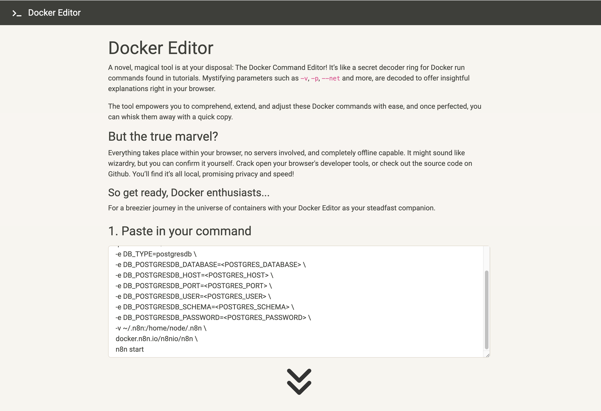
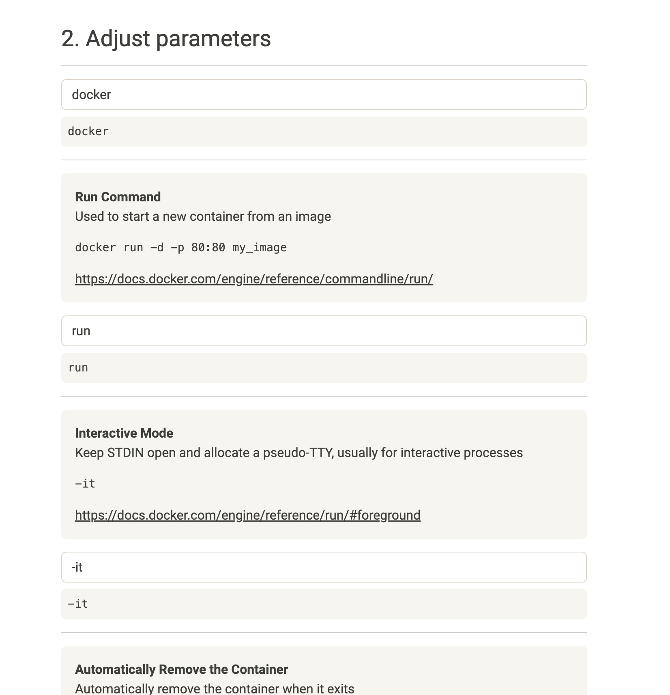

# Docker Editor

## Description

A novel, magical tool is at your disposal: The Docker Command Editor! It’s like a secret decoder ring for Docker run commands found in tutorials. Mystifying parameters such as `-v`, `-p`, `--net` and more, are decoded to offer insightful explanations right in your browser.

The tool empowers you to comprehend, extend, and adjust these Docker commands with ease, and once perfected, you can whisk them away with a quick copy.

### But the true marvel?

Everything takes place within your browser, no servers involved, and completely offline capable. It might sound like wizardry, but you can confirm it yourself. Crack open your browser's developer tools, or check out the source code on Github. You’ll find it’s all local, promising privacy and speed!

#### So get ready, Docker enthusiasts...

For a breezier journey in the universe of containers with your Docker Editor as your steadfast companion.

